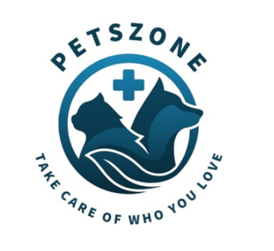
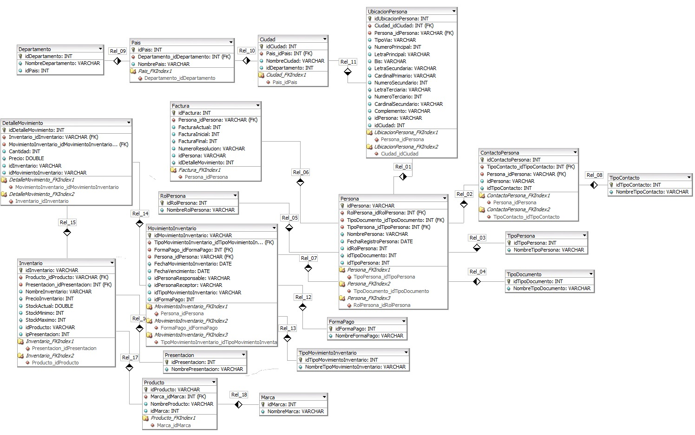

# PetsZone-Backend
 **Logo**

<em>The objective of this project is to develop a mobile application for PetsZone, a veterinary clinic dedicated to providing comprehensive care for pets. The application aims to enhance the client experience by offering a user-friendly interface where pet owners can easily access veterinary services, schedule appointments, and receive important updates regarding their pets' health.
 
 
  <b>DATABASE</b>
    
  The following entity-relationship model is used for the PetsZone database.

 
<b>Projec Members</b> 
  <ul>
  <li>Zarela Lizarazo</li>
  <li>Andres Sinuco</li>
<li>Diego Quintero</li>
<li>Imanol Villamizar</li>
  </ul>

