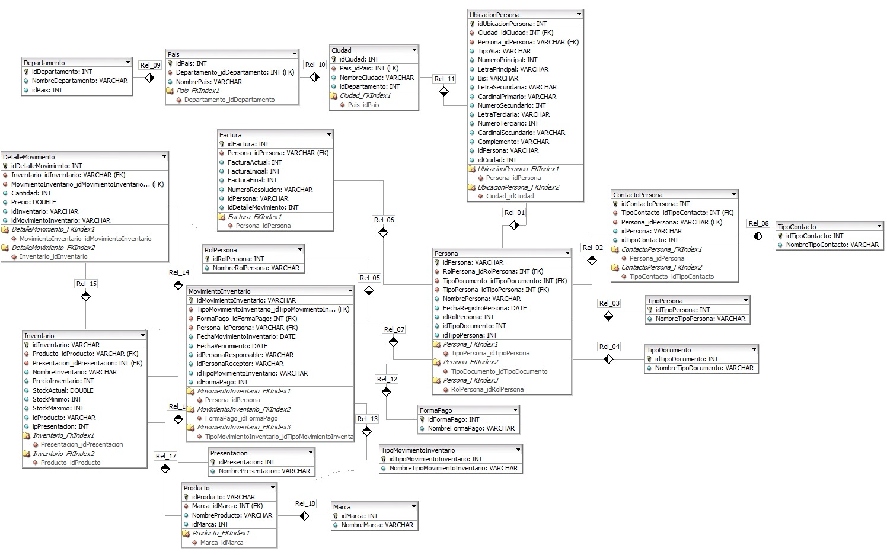

# PetsZone-Backend 🐾
 **Logo**
<div align="center">

</div>
<em>The objective of this project is to develop a mobile application for PetsZone, a veterinary clinic dedicated to providing comprehensive care for pets. The application aims to enhance the client experience by offering a user-friendly interface where pet owners can easily access veterinary services, schedule appointments, and receive important updates regarding their pets' health.
<br>
<br><hr>
  <b><h2>DATABASE🛢</h2></b>
  <br><br>
  The following entity-relationship model is used for the PetsZone database.
<div align="center">

</div>
  <h2>Main Tables</h2>
    <ul>
        <li>
            <strong>Persona:</strong> Contains personal information such as identifier (<em>idPersona</em>), name, registration date, document type, and more.
        </li>
        <li>
            <strong>UbicacionPersona:</strong> Stores location data including main address, secondary address, city, and country.
        </li>
        <li>
            <strong>Factura:</strong> Records billing data, including the person's identifier, date, resolution number, etc.
        </li>
        <li>
            <strong>MovimientoInventario:</strong> Details inventory movements, indicating the date, type of movement, payment method, and more.
        </li>
        <li>
            <strong>Inventario:</strong> Contains information on the products available in the inventory, such as quantity, price, stock, etc.
        </li>
        <li>
            <strong>Producto:</strong> Stores specific information about the products available, such as product name and brand.
        </li>
        <li>
            <strong>ContactoPersona:</strong> Registers contacts associated with a person, including the contact type and the corresponding person.
        </li>
    </ul>
<br>
    <h2>Related Tables</h2>
    <ul>
        <li>
            <strong>Pais, Departamento, Ciudad:</strong> These tables are hierarchically related to store geographical location.
        </li>
        <li>
            <strong>TipoPersona, TipoDocumento, TipoContacto:</strong> Define the corresponding types for people, documents, and contacts.
        </li>
        <li>
            <strong>DetalleMovimiento:</strong> Links inventory movements with specific details of each involved product.
        </li>
    </ul>
<br><hr>
<b>Projec Members</b><br>
  <ul>
  <li>Zarela Lizarazo</li>
  <li>Andres Sinuco</li>
<li>Diego Quintero</li>
<li>Imanol Villamizar</li>
  </ul><hr>
<h2>Routes for GET Method</h2>

<b>Obtain an invoice by ID:</b> <br>
http://localhost:4000/facturas/:idFactura <br><br>
This endpoint retrieves the details of a specific invoice identified by the idFactura parameter. The idFactura parameter is a placeholder for the unique identifier of the invoice you want to access. When you send a GET request to this URL with a specific idFactura, the server responds with the data corresponding to that invoice.

<b>Parameters:</b>
<ul>
<li>idFactura (path parameter): The unique identifier of the invoice.</li>
  </ul>
<b>Response:</b>
<ul>
<li><b>200 OK:</b>Returns the invoice details if the idFactura is valid.</li>
<li><b>404 Not Found:</b> Returns an error message if the idFactura does not exist.</li>
</ul>

<b>Saving path :</b> <br>
http://localhost:4000/api/facturas/guardar/idPersona/:idPersona/fechaFactura/:fechaFactura/numeroResolucion/:numeroResolucion
<br>
       This endpoint is used to save a new invoice with specific details. It requires three path parameters:
- **idPersona**: The unique identifier of the person associated with the invoice.
- **fechaFactura**: The date of the invoice in a specified format.
- **numeroResolucion**: The resolution number of the invoice.

When a GET request is made to this URL with valid parameters, the server processes the data and saves the new invoice.

## Parameters
- **idPersona** (path parameter): The unique identifier of the person.
- **fechaFactura** (path parameter): The date of the invoice (format should be specified, e.g., YYYY-MM-DD).
- **numeroResolucion** (path parameter): The resolution number of the invoice.

## Response
- **200 OK**: Returns a confirmation that the invoice has been saved successfully.
- **400 Bad Request**: Returns an error message if any of the parameters are invalid or missing.
- **404 Not Found**: Returns an error message if the endpoint is incorrect or not found.

# Video explaining API routes
https://youtu.be/dmnA6LTj19Q

# Veterinary Management App - Frontend

This repository contains the frontend code for a veterinary management system built using **React Native**. The app allows users to manage pets and invoices for a veterinary clinic and includes a secure login system that interacts with a backend API. Below is an overview of key sections of the app, including the login process, API communication, and the functionalities for managing pets and invoices.

## 1. Login System

### Overview
The login functionality enables users to authenticate themselves by entering their email and password. Only authorized users can access the dashboard where they can manage pets and invoices.

### How It Works
- The login form collects the user’s email and password.
- Upon clicking the "Login" button, the app sends a **POST** request to the backend API at the `login.php` endpoint.
- The backend verifies the user credentials, and if valid, the app navigates the user to the **Dashboard** screen. If the credentials are incorrect, an error message is displayed.

### Key Components
- **Login Form**: Uses `Input` components from React Native Elements to capture the email and password.
- **API Request**: The login details are sent to the backend using **Axios**, where the backend checks the credentials.
- **Error Handling**: If the login attempt fails, an alert displays the appropriate error message.

```javascript
axios.post('http://<your-local-server-ip>/vetmascotas/login.php', { email, password })
  .then(response => {
    if (response.data.success) {
      navigation.navigate('Dashboard');
    } else {
      Alert.alert('Login Failed', 'Invalid credentials');
    }
  })
  .catch(error => {
    Alert.alert('Error', 'Failed to connect to API');
  });

```
## 2. API Integration

### Overview
The app consumes a custom backend API for all operations. The API is hosted on a local XAMPP server (or any other LAMP/WAMP server) and connects to a MySQL database where all the relevant data for pets, invoices, and users is stored.

### API Endpoints
- **Login API (`login.php`)**: Verifies user credentials.
- **Create Invoice API (`crear_factura.php`)**: Allows users to create an invoice by sending relevant data (client, amount, description).
- **Manage Pets API (`gestionar_mascotas.php`)**: Fetches pet details, allows adding new pets, and updates pet information.

### Handling Requests
For each operation (login, creating an invoice, managing pets), the app sends HTTP requests using Axios to interact with the backend, and updates the UI accordingly based on the response.

---

## 3. Invoice Management

### Overview
The app allows users to create and manage invoices directly from the dashboard.

### How It Works
- The **Create Invoice Screen** presents a form where users can enter client details, invoice amount, and description.
- When the "Create Invoice" button is pressed, the app sends a POST request with the invoice data to the `crear_factura.php` API endpoint.
- If the invoice is created successfully, the app clears the form and displays a success message.

### Key Components
- **Invoice Form**: Text inputs to capture client name, amount, and a description of the service.
- **API Integration**: A POST request sends the form data to the backend.
- **Success/Error Handling**: The app provides feedback based on the success of the request.
 ```javascript 
axios.post('http://<your-local-server-ip>/vetmascotas/crear_factura.php', {
  cliente, monto, descripcion
})
.then(response => {
  if (response.data.success) {
    Alert.alert('Success', 'Invoice created');
  } else {
    Alert.alert('Error', 'Failed to create invoice');
  }
})
.catch(error => {
  Alert.alert('Error', 'API connection failed');
}); ```

## 4. Pet Management

### Overview
The app also includes a section for managing pet information. Users can view, add, and update pet details from the Dashboard.

### How It Works
- From the dashboard, users can navigate to the **Pet Management Screen**, where they can see a list of pets or add new pets to the system.
- For adding or updating pet details, a form similar to the invoice form is used. The pet data is sent to the backend via an API request.

### Key Components
- **Pet List**: Displays a list of pets with details like name, breed, and owner.
- **Pet Form**: Allows users to add or update pet information (e.g., name, breed, age, and owner).
- **API Integration**: Communicates with the `gestionar_mascotas.php` endpoint to retrieve, add, or update pet data.

---

## 5. Dashboard

### Overview
The dashboard acts as the central hub for navigating between the different management sections of the app.

### Key Sections
- **Manage Pets**: Redirects to the Pet Management Screen.
- **Manage Invoices**: Redirects to the Invoice Creation Screen.
 ```javascript 
<Button
  title="Manage Pets"
  onPress={() => navigation.navigate('ManagePetsScreen')}
/>
<Button
  title="Create Invoice"
  onPress={() => navigation.navigate('CreateInvoiceScreen')}
/> ```
